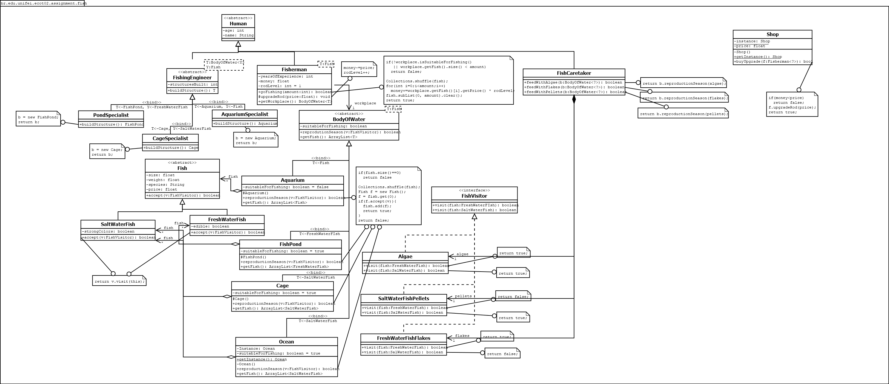

# Modelagem Orientada a Objetos em Java

Projeto desenvolvido com foco em Arquitetura de Software e Programação Orientada a Objetos (POO), utilizando **Java** e **Maven**.

## 📐 Diagrama de Classes (UML)

## 🛠️ Tecnologias e Ferramentas
- **Linguagem:** Java
- **Gerenciador de Dependências:** Maven
- **Modelagem:** Dia (UML)
